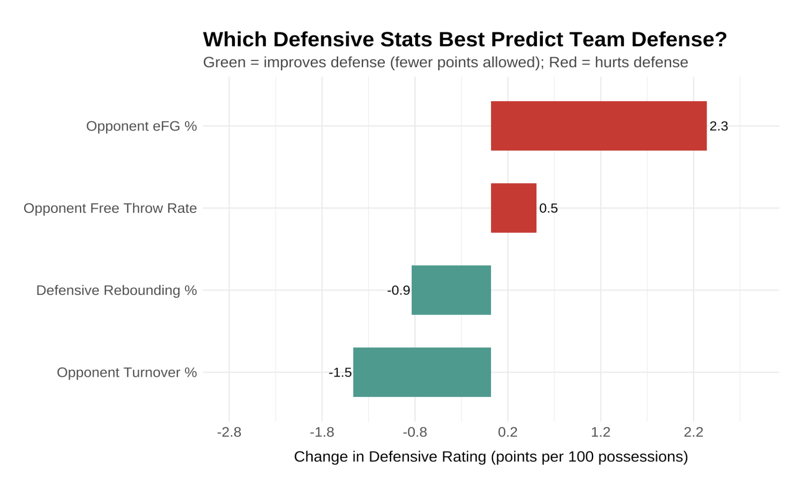

# 🏀 Defensive Efficiency: A Multi-Season Analysis of Key Predictors

This project analyzes which defensive factors best predict **Defensive Rating** (points allowed per 100 possessions) across five NBA seasons (2020–21 to 2024–25). Using league-wide data and regression modeling, it provides actionable insights for coaches and analysts looking to optimize team defense.

---

## 🎯 Project Purpose

A coach asked: *"Is defensive rebounding actually a major contributor to team defense?"*

To answer this and uncover the broader picture, this project evaluates how four key defensive stats — **Defensive Rebounding %, Opponent eFG%, Opponent Turnover %, and Opponent FT Rate** — influence Defensive Rating over five seasons.

---

## 📊 Key Findings

* **Opponent eFG%** is the strongest predictor of Defensive Rating — limiting opponent shot quality is crucial.
* **Opponent Turnover %** significantly helps teams by reducing opponent shot volume.
* **Defensive Rebounding %** contributes positively but has less impact compared to eFG% and TOV%.
* **Opponent FT Rate** worsens defensive efficiency: teams that foul more give up easy points.

All predictors were standardized to make effect sizes comparable. A fixed-effects model adjusted for season-to-season shifts.

---

## 🛠️ Technical Summary

* **Data Source**: [`hoopR`](https://github.com/sportsdataverse/hoopR) R package (scrapes NBA Stats API)
* **Seasons Covered**: 2020–21 through 2024–25
* **Metrics Engineered**:

  * `Opponent eFG% = (FGM + 0.5 * 3PM) / FGA`
  * `Opponent TOV% = TOV / (FGA + 0.44 * FTA + TOV)`
  * `Opponent FT Rate = FTA / FGA`
* **Model**: Multiple linear regression with standardized predictors and season fixed effects

```r
model <- lm(
  DefRtg ~ scale(DRB) + scale(Opp_eFG) + scale(Opp_TOV) + scale(Opp_FTRate) + Season,
  data = full_data
)
```

---

## 📈 Final Visualization

This plot shows how each metric affects Defensive Rating. Green bars indicate metrics that **help defense** , while red bars **hurt defense**.


---

## 👌 For Coaches

We used 5 years of NBA team data (2020–21 through 2024–25) to understand what best predicts great defense. Results confirm:

* **Elite defenses limit shot quality** (eFG%) and **force turnovers**
* **Fewer fouls** and **solid defensive rebounding** also contribute, but are less impactful

Use this to emphasize areas that statistically matter most when building or evaluating your team defense.

---

## 🧠 Project Thinking

This project was built to answer a key basketball analytics question: *"What defensive stats most strongly predict team success on defense?"*

We:

* Collected advanced and opponent stats from the NBA's last five seasons using the `hoopR` package
* Built a regression model using standardized variables to compare relative impact
* Visualized the coefficients for interpretability, especially for coaches
* Included season-level controls to ensure robustness over time

---

## 📦 Dependencies

* R and Quarto
* Packages: `ggplot2`, `dplyr`, `broom`, `scales`, `ggtext`, `showtext`, `hoopR`
* NBA Stats via the `sportsdataverse` API

---

*Built with R, `ggplot2`, `broom`, `showtext`, `ggtext`, and `hoopR`. Data from NBA Stats via `sportsdataverse`.*
